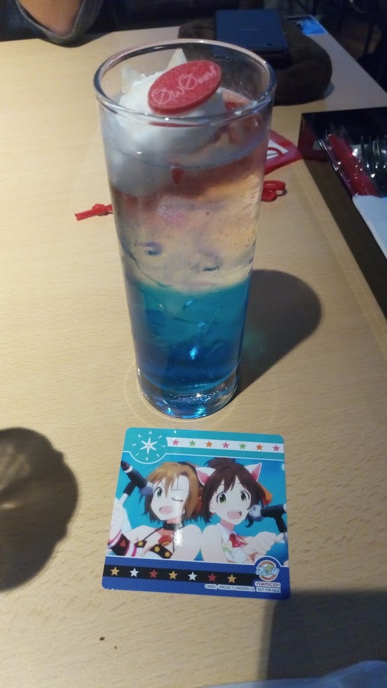
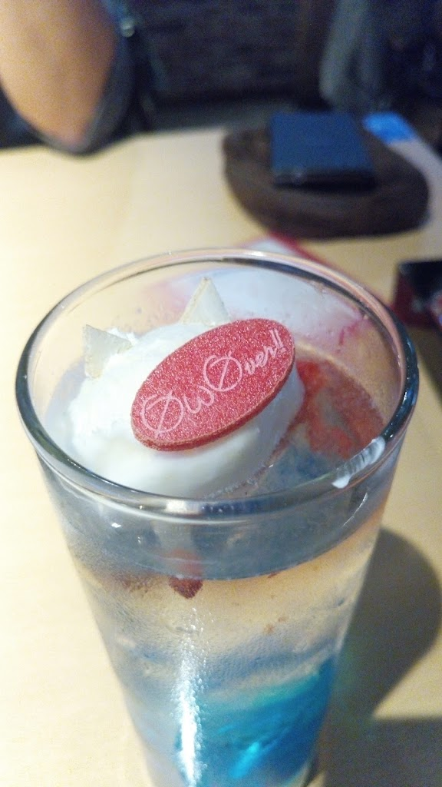
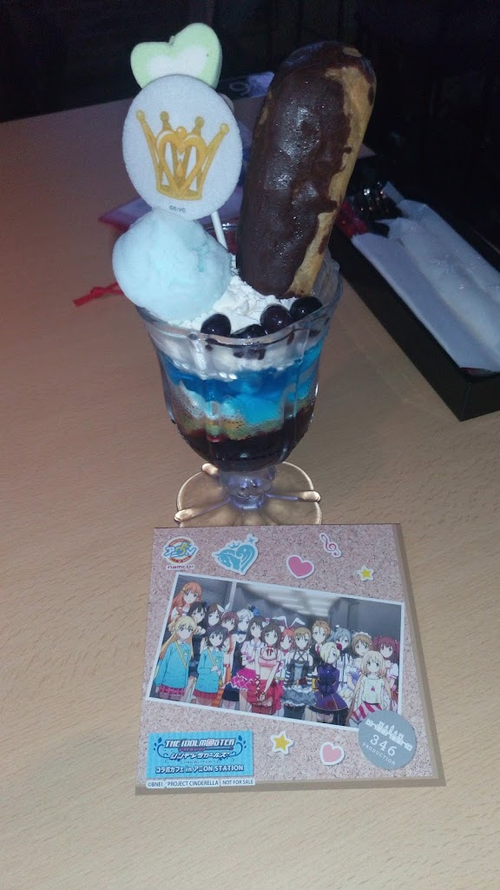
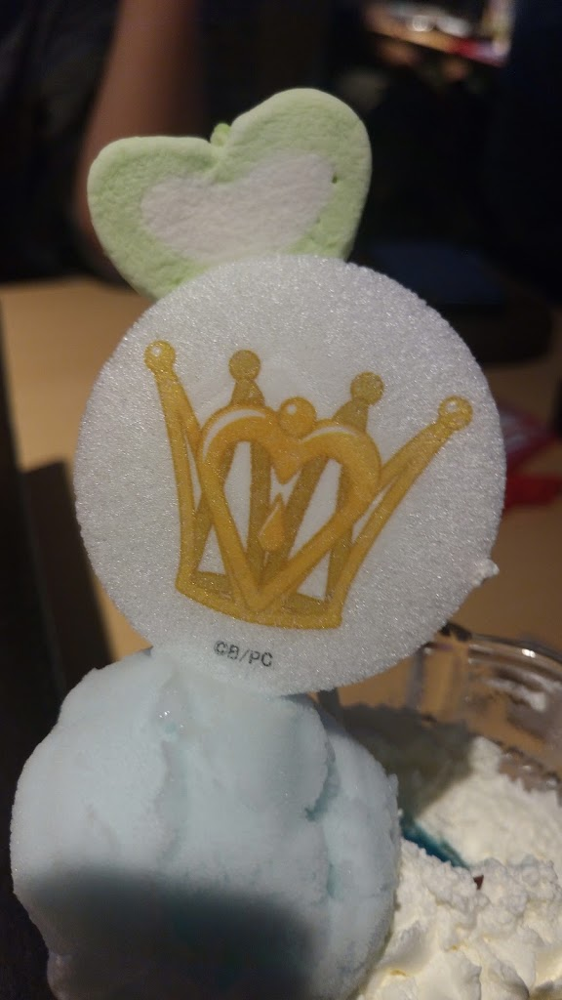
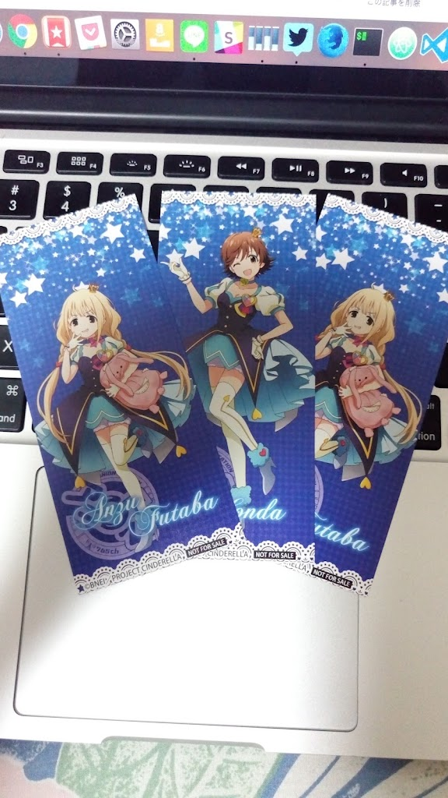

### アニONコラボ

以前アニメ期間中にアニメイトカフェで行われていたコラボカフェに続きアニON STATIONにてシンデレラガールズのコラボカフェが開催されております． 開催期間も終わりに近づいてきたので１度は行かねばと思い行ってきたのでレポ！ [アイドルマスター シンデレラガールズ コラボカフェ in アニON STATION | アニON（アニオン） | ナムコ 「夢・遊び・感動」を。](http://www.namco.co.jp/cafe_and_bar/anionstation/collaborations/imas-cinderella/20160906.html)

### アニON STATIONってなんぞや？

ぶっちゃけデレマスコラボが発表されるまで存在を知りませんでした． 公式のページには以下のような記載が． 

> アニON STATION(アニオンステーション)は 大好きなアニメやアーティストの音楽と映像に囲まれた空間で コラボ料理が楽しめる次世代キャラクターカフェです 楽曲リクエストやMCトークなど、アニONならではの演出も盛りだくさん アニONでしか味わえない空間をぜひご体験ください♪

[アニONについて | アニON（アニオン） | ナムコ 「夢・遊び・感動」を。](http://www.namco.co.jp/cafe_and_bar/anionstation/about/) つまりアニメイトカフェと似たような感じのコラボメインのカフェですね． アニメイトカフェと違うのは楽曲リクエストとMCによるトークがあるところでしょうか． 今回行ったのは秋葉原店で2016年7月にオープンしたできたてホヤホヤのお店です． 運営がNAMCOのようなので今後も色々なゲーム・アニメコラボが開催されるかもしれないですね， 

### コラボメニュー

コラボカフェと言ったらコラボメニュー． 今回も色々とコラボメニューがあり，ドリンクは期間によって注文できるドリンクが変わるとのことでした． 

#### Asteriskの♡Beatソーダ

好きなアスタリスクのドリンクを注文． ノンアルコールで注文したのでスプライト＋ブルーゼリー． 下半分は青いゼリーで埋め尽くされています．  上にはφωφverのモナカと猫耳っぽいバニラアイスが乗っかっておりその下にいちごが少し入っていました．  飲んだ感じは普通のスプライト． 後半に上のバニラが溶けてややまろやかになる感じはありました． 時々ゼリーも一緒にストローで吸い上げてしまうのでやや飲みにくかったです． 

### キラキラの魔法☆ゴージャス Star!! パフェ

言ったのはお昼時だったのですがパフェが食べたくなりこちらをチョイス．  写真ではわかりづらいかもしれませんがちょっと大きめなサイズ感というか普通のパフェサイズ． 上にはエクレア，マシュマロ，ソーダゼリーが乗っており，下には生クリーム，ソーダゼリー，シリアル，ブルーベリーシロップとなっていました．  アイスに王冠がプリントされたモナカが刺さっておりました． エクレアとシリアルが入っているので意外とボリュームあって美味しかったです． 

### juke box rock on & ON STAGE LIVE

パーティタイムに開催されるアニONの目玉であるjuke box rock onとON STAGE LIVEです． juke box rock onは入店時とフード注文時にもらえるリクエストチケットで自分の好きな曲をリクエストできるというプログラム． MCが曲紹介とコメントを読み上げてくれて曲中はペンライトの使用やコールもOKなのでライブのように盛り上がることもできます．  見事に杏がかぶってしまいました．．． ただ，画面にはjuke box rock onのロゴが写っているだけなのでどこを向いてペンライトを振れば良いのかに悩みました． 画面にデレステのPVでも流してくれたら非常に盛り上がるのかなと思うのですが． また，コールも任意なのでコールしない方が多いと恥ずかしさに打ち勝つ必要がありますね．．． 面白いプログラムだとは思うのですが． ON STAGE LIVEはスクリーンにアニメOP/ED曲のPVを流すものでした． スクリーンの大画面で見ることができるのは良いですね． 

### コラボグッズもあるよ！

アニON STATION限定のコラボTシャツやマフラータオルなども販売しておりました． Asteriskのマフラータオルが欲しかったのですが行ったときにはニュージェネ，凸レーション，Rosenburg Engelしかありませんでした．．． 欲しいものがあるときは早めに訪問しましょう！ 

### 新宿で追加開催決定

10/5(木)までの開催でしたが新宿の店舗で追加開催が決定したようです． 展示物的にはアニメイトカフェのほうが多かったので見る分には物足りないですがその分コールなどで盛り上がって他のプロデューサーとの交流もできると思うので行き逃した方は行ってみたらいかがでしょうか．
